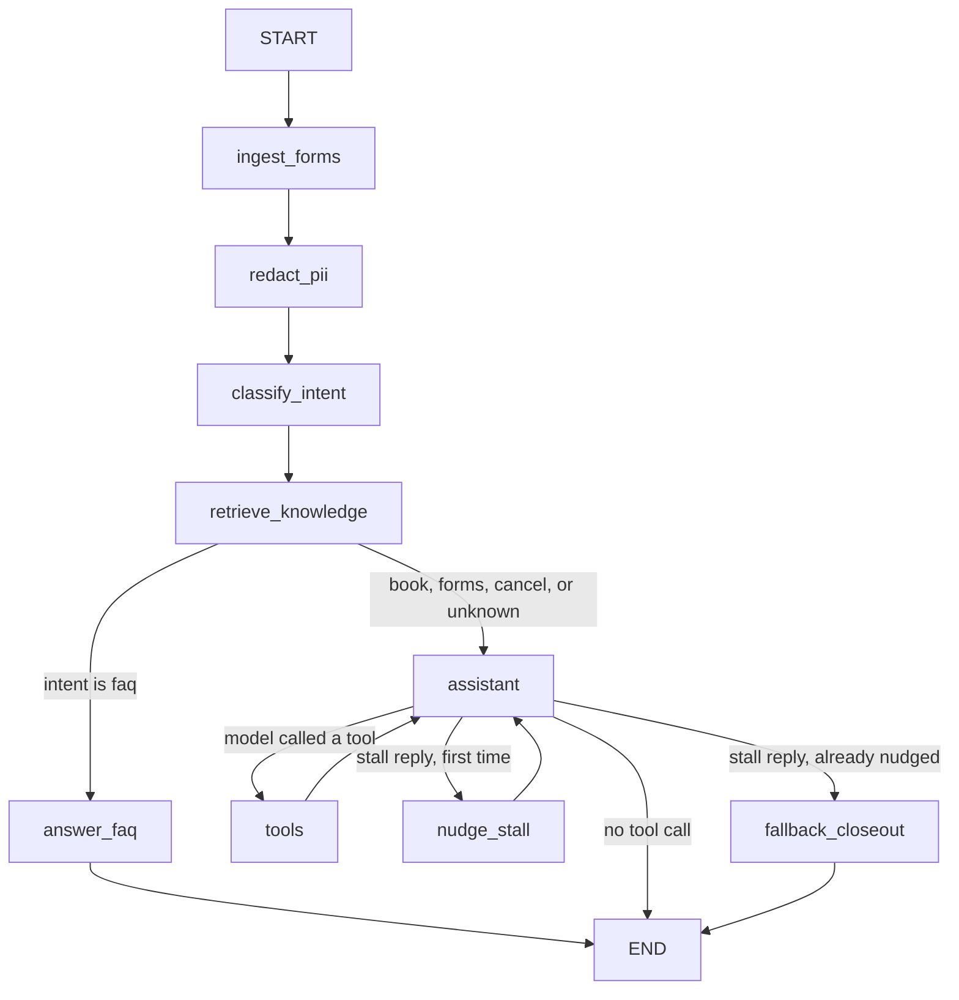
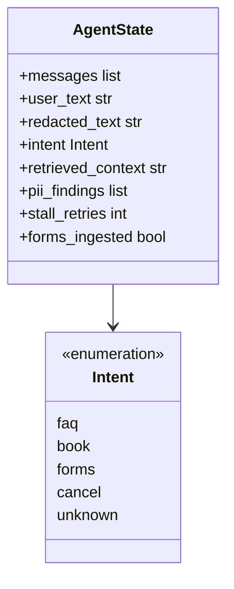

# Riverside Family Dental — front desk agent

Small LangGraph + LangChain demo that could sit at a dental front desk. It answers office questions from a mini knowledge base, collects new-patient forms, and books or cancels visits against a JSON file.

This is a teaching demo, not a production clinic system.

## What it does

Patients can:

- Ask for **a named dentist** (`Dr. Chen`) or **any dentist**
- Ask policy questions (hours, insurance, who works here, new-patient rules)
- Submit **new-patient forms**
- Book or cancel a visit

Returning patients already on file: **Alex Rivera** (prefers Dr. Chen) and **Sam Ortiz**.

Dentists on staff:


| Dentist            | Specialty    | Days          |
| ------------------ | ------------ | ------------- |
| Dr. Sarah Chen     | General      | Mon–Fri       |
| Dr. Travis Spuller | General      | Mon, Wed, Fri |
| Dr. Marcus Webb    | Orthodontics | Mon, Wed, Fri |
| Dr. Priya Patel    | Pediatric    | Tue, Wed, Thu |
| Dr. James Okonkwo  | Oral surgery | Tue, Thu      |


New patients are not booked until forms are saved. Labeled intake fields are written to the JSON database before the model sees them. That rule is also enforced when booking.

## How state moves




1. `ingest_forms` parses labeled intake fields (Name, Date of birth, Phone, Insurance, Medical notes). If all five are present they are saved to the JSON database with `forms_complete=true`. The model only sees a sanitized note plus the patient name.
2. `redact_pii` copies SSN / email / phone / slash-dates out of the log text.
3. `classify_intent` labels the turn: `faq`, `book`, `forms`, `cancel`, or `unknown`.
4. `retrieve_knowledge` always runs BM25 RAG so the next node has office notes.
5. **Decision:** FAQ goes to a grounded answer and stops. Everything else goes to the tool-using assistant.
6. `assistant` **↔** `tools` looks up patients, reads open slots, books, or cancels. The JSON file is the source of truth.
7. `nudge_stall` **/** `fallback_closeout` retry once if the model stalls (“booking now” with no tool call), then close with a question.

LangGraph carries this `AgentState` from node to node (`src/state.py`):




| Field               | What it holds                                             | Who writes it                                                                                            |
| ------------------- | --------------------------------------------------------- | -------------------------------------------------------------------------------------------------------- |
| `messages`          | Chat history (appended, not replaced)                     | `starting_state`, `ingest_forms`, `assistant`, `tools`, `answer_faq`, `nudge_stall`, `fallback_closeout` |
| `user_text`         | Patient input for this turn, with intake values stripped  | `starting_state`, then `ingest_forms` if labeled fields were present                                     |
| `redacted_text`     | Same text with SSN / email / phone / slash-dates stripped | `redact_pii`                                                                                             |
| `intent`            | `faq`, `book`, `forms`, `cancel`, or `unknown`            | `classify_intent`                                                                                        |
| `retrieved_context` | BM25 office notes for this turn                           | `retrieve_knowledge`                                                                                     |
| `pii_findings`      | Labels of PII types found (for logs / LangSmith)          | `redact_pii`                                                                                             |
| `stall_retries`     | How many times a stall reply was nudged                   | `nudge_stall` (starts at `0`)                                                                            |
| `forms_ingested`    | True when this turn saved a complete intake form          | `ingest_forms`                                                                                           |


Nodes only return the fields they change. `messages` uses LangGraph’s `add_messages` reducer so tool calls and replies accumulate instead of overwriting the turn.

## Design notes

The graph is explicit on purpose. Intake, redaction, intent, retrieval, and scheduling are separate LangGraph nodes so a reviewer can see what ran, not infer it from one prompt.

**Forms never reach the model.** `ingest_forms` parses labeled fields (Name, Date of birth, Phone, Insurance, Medical notes) and writes them to `office.json` before any LLM call. The assistant only sees a sanitized note plus the patient name. Booking tools also refuse new patients until `forms_complete` is true. That is a code rule, not a prompt suggestion.

**JSON file instead of a hosted database.** A json file was used as a replacement for the database for simplicity. You can read the office, reset it from a seed, and point evals at a temp copy.

**BM25 instead of embeddings.** The knowledge base is a handful of markdown files. Keyword retrieval avoids a vector store and a second API. `dentists.md` is split on `##` headings so a bio lookup does not dump the whole staff file.

**FAQ and scheduling are different paths.** Policy questions go to a grounded FAQ node that cannot call booking tools, so hours and insurance answers stay tied to retrieved notes. Book, cancel, and forms go to a tool-using assistant; dentists and slots come only from `office.json`.

**CLI, not an HTTP API.** The entry point is `python -m src.cli` so traces and evals stay local. LangSmith is the observability layer; `gpt-4o-mini` at temperature 0 keeps evals somewhat stable.

## Quickstart

You need Python 3.11+ and two API keys: OpenAI (model calls) and LangSmith (traces / evals).

### Windows

```powershell
.\setup.ps1
.\.venv\Scripts\Activate.ps1
```

Edit `.env` and set `OPENAI_API_KEY` and `LANGSMITH_API_KEY`.

### Mac / Linux

```bash
make setup
source .venv/bin/activate
cp .env.example .env
```


### Run

```bash
python -m src.cli
```

Useful commands:

```bash
python -m src.cli --reset-db       # restore data/office.json from the seed
python -m src.cli --once "Are you open Saturday?"
python -m evals.run_evals          # local expected-outcome scores
python -m evals.run_evals --langsmith
```

Inside the chat you can type `reset` or `quit`.

### Docker

```bash
docker build -t riverside-dental-agent .
docker run --rm -it --env-file .env riverside-dental-agent
```


## Try these prompts

```
Are you open on Saturday?
Do you take Medicaid?
I am Alex Rivera. Book a cleaning with Dr. Chen on Tuesday at 2pm.
This is Sam Ortiz. Any dentist Friday at 9am for a checkup.
I am a new patient named Jamie Cole. Book me tomorrow morning.
Please file my new patient forms. Name: Jamie Cole. Date of birth: 1994-02-08. Phone: 555-0199. Insurance: none. Medical notes: no allergies.
```

After Jamie's forms are saved (before the model sees the labeled values), ask again to book any dentist. The second turn should succeed.

## LangSmith

With `LANGSMITH_TRACING=true` and `LANGSMITH_API_KEY` set, each turn is a trace in the `riverside-dental-agent` project.

You should see the node path (`ingest_forms` → `redact_pii` → `classify_intent` → `retrieve_knowledge` → …), tool calls, and metadata:

- `redacted_input` — PII stripped copy of the user text
- `case_id` — present on eval runs

Open [https://smith.langchain.com](https://smith.langchain.com) and filter by project `riverside-dental-agent`.

## Evals

`evals/dataset.json` is seven cases. Each case has:

- `expected_intent`
- `answer_must_include_any` — at least one phrase must appear in the reply
- `appointment_created` — whether `office.json` should gain a new visit

The runner uses a temp copy of the database so your demo file is not left dirty.

## Improvements

What I would do with more time:

- **Express API, hosted database, and MCP.** Replace the JSON file and CLI with a proper Express API, a hosted database, and a real MCP interface so other agents can call lookup / book / cancel as tools instead of going through this process.
- **Form validator.** Intake currently accepts any labeled strings. Validate date of birth, phone, insurance, and medical notes, and reject incomplete or malformed new-patient forms before they are written.
- **Embeddings instead of BM25.** Swap BM25 for OpenAI embeddings (or similar) plus document fetching so retrieval ranks by meaning, not keyword overlap, and can pull the right section from larger office documents.
- **Conversational intake, not only labeled fields.** Forms only parse `Name: … Date of birth: …` lines. A real front desk should collect missing fields over a few turns, confirm them, and never require the patient to paste a labeled blob.
- **Reschedule, waitlist, and a real calendar.** There is book and cancel only, against hardcoded dentist slots. Add reschedule, a waitlist, time zones, and a real calendar (or practice-management API) instead of a static `slots` list on each dentist.
- **Human handoff and confirmations.** Escalate to a person when the model stalls twice, the dentist is unknown, or the patient asks for one. Send a booking confirmation (email/SMS) with an appointment id instead of only a chat reply.
- **Broader evals and unit tests.** The dataset is single-turn phrase checks. Add the two-turn new-patient path (forms, then book), cancel, PII-leak, and unknown-dentist cases; score with an LLM-as-judge; put unit tests on `parse_date`, form ingest, and booking rules; run them in CI.

