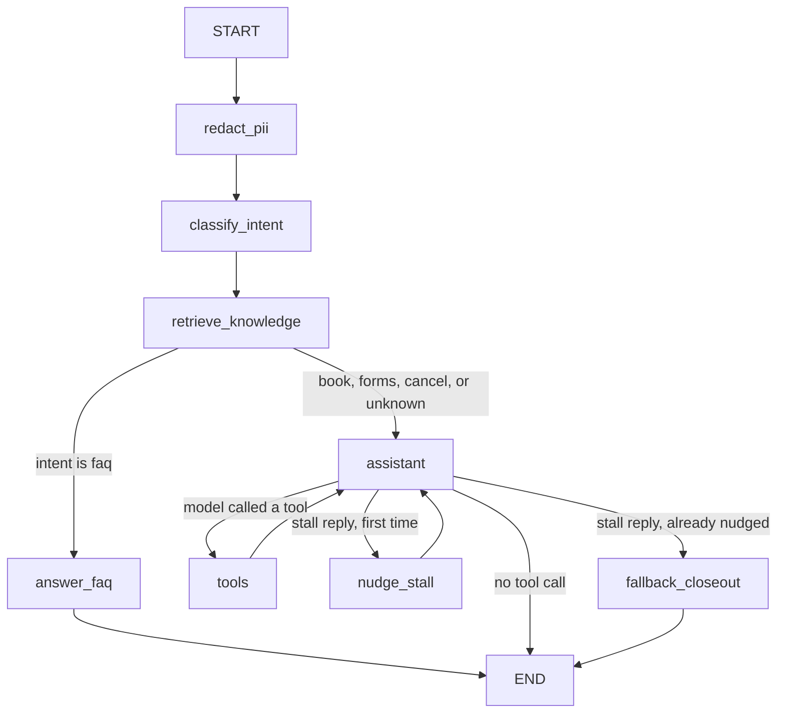
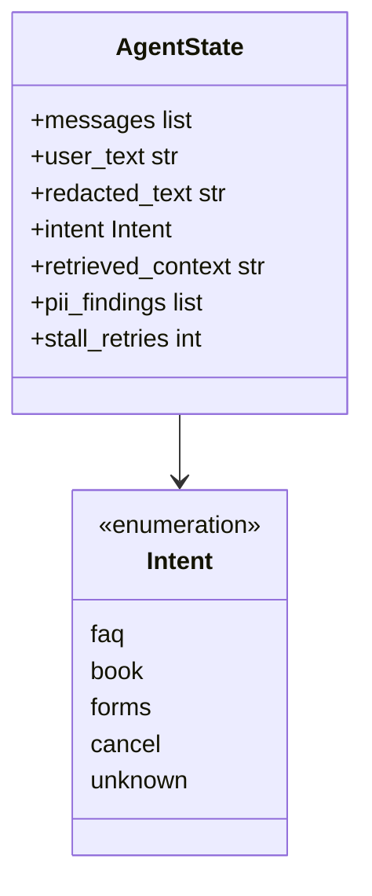

# Riverside Family Dental — front desk agent

Small LangGraph + LangChain demo that could sit at a dental front desk. It answers office questions from a mini knowledge base, collects new-patient forms, and books or cancels visits against a JSON file.

This is a teaching demo, not a production clinic system.

## What it does

Patients can:

- Ask for **a named dentist** (`Dr. Chen`) or **any dentist**
- Ask policy questions (hours, insurance, who works here, new-patient rules)
- Submit **new-patient forms**
- Book or cancel a visit

Returning patients already on file: **Alex Rivera** (prefers Dr. Chen) and **Sam Ortiz**.

Dentists on staff:


| Dentist            | Specialty    | Days          |
| ------------------ | ------------ | ------------- |
| Dr. Sarah Chen     | General      | Mon–Fri       |
| Dr. Travis Spuller | General      | Mon, Wed, Fri |
| Dr. Marcus Webb    | Orthodontics | Mon, Wed, Fri |
| Dr. Priya Patel    | Pediatric    | Tue, Wed, Thu |
| Dr. James Okonkwo  | Oral surgery | Tue, Thu      |


New patients are not booked until forms are saved. That rule is enforced in the JSON tools, not only in the prompt.

## Challenge checklist


| Must-have                        | Where it lives                                |
| -------------------------------- | --------------------------------------------- |
| LangGraph state and control flow | `src/state.py`, `src/graph.py`                |
| LangChain model, tools, RAG      | `src/llm.py`, `src/tools.py`, `src/rag.py`    |
| LangSmith traces                 | `.env.example` + run metadata in `src/cli.py` |
| End-to-end office task           | Book / forms / FAQ in one graph               |
| Graph clarity                    | Mermaid diagram and state schema below        |
| At least one tool                | Six tools in `src/tools.py`                   |
| RAG over a mini KB               | `data/knowledge/*.md`                         |
| One eval dataset                 | `evals/dataset.json`                          |


| Nice-to-have              | Where it lives                        |
| ------------------------- | ------------------------------------- |
| PII redaction             | `src/guardrails.py`                   |
| Streaming output          | `src/cli.py`                          |
| Makefile / setup / Docker | `Makefile`, `setup.ps1`, `Dockerfile` |


A readme for every file is in [FILE_GUIDE.md](FILE_GUIDE.md).

## How state moves




1. `redact_pii` copies SSN / email / phone / slash-dates out of the log text.
2. `classify_intent` labels the turn: `faq`, `book`, `forms`, `cancel`, or `unknown`.
3. `retrieve_knowledge` always runs BM25 RAG so the next node has office notes.
4. **Decision:** FAQ goes to a grounded answer and stops. Everything else goes to the tool-using assistant.
5. `assistant` **↔** `tools` looks up patients, reads open slots, saves forms, books, or cancels. The JSON file is the source of truth.
6. `nudge_stall` **/** `fallback_closeout` retry once if the model stalls (“booking now” with no tool call), then close with a question.

LangGraph carries this `AgentState` from node to node (`src/state.py`):




| Field               | What it holds                                             | Who writes it                                                                            |
| ------------------- | --------------------------------------------------------- | ---------------------------------------------------------------------------------------- |
| `messages`          | Chat history (appended, not replaced)                     | `starting_state`, `assistant`, `tools`, `answer_faq`, `nudge_stall`, `fallback_closeout` |
| `user_text`         | Raw patient input for this turn                           | `starting_state`                                                                         |
| `redacted_text`     | Same text with SSN / email / phone / slash-dates stripped | `redact_pii`                                                                             |
| `intent`            | `faq`, `book`, `forms`, `cancel`, or `unknown`            | `classify_intent`                                                                        |
| `retrieved_context` | BM25 office notes for this turn                           | `retrieve_knowledge`                                                                     |
| `pii_findings`      | Labels of PII types found (for logs / LangSmith)          | `redact_pii`                                                                             |
| `stall_retries`     | How many times a stall reply was nudged                   | `nudge_stall` (starts at `0`)                                                            |


Nodes only return the fields they change. `messages` uses LangGraph’s `add_messages` reducer so tool calls and replies accumulate instead of overwriting the turn.

## Quickstart

You need Python 3.11+ and two API keys: OpenAI (model calls) and LangSmith (traces / evals).

### Windows

```powershell
.\setup.ps1
.\.venv\Scripts\Activate.ps1
```

Edit `.env` and set `OPENAI_API_KEY` and `LANGSMITH_API_KEY`.

### Mac / Linux

```bash
make setup
source .venv/bin/activate
cp .env.example .env
```


### Run

```bash
python -m src.cli
```

Useful commands:

```bash
python -m src.cli --reset-db       # restore data/office.json from the seed
python -m src.cli --once "Are you open Saturday?"
python -m evals.run_evals          # local expected-outcome scores
python -m evals.run_evals --langsmith
```

Inside the chat you can type `reset` or `quit`.

### Docker

```bash
docker build -t riverside-dental-agent .
docker run --rm -it --env-file .env riverside-dental-agent
```


## Try these prompts

```
Are you open on Saturday?
Do you take Medicaid?
I am Alex Rivera. Book a cleaning with Dr. Chen on Tuesday at 2pm.
This is Sam Ortiz. Any dentist Friday at 9am for a checkup.
I am a new patient named Jamie Cole. Book me tomorrow morning.
Please file my new patient forms. Name: Jamie Cole. Date of birth: 1994-02-08. Phone: 555-0199. Insurance: none. Medical notes: no allergies.
```

After Jamie's forms are saved, ask again to book any dentist. The second turn should succeed.

## LangSmith

With `LANGSMITH_TRACING=true` and `LANGSMITH_API_KEY` set, each turn is a trace in the `riverside-dental-agent` project.

You should see the node path (`redact_pii` → `classify_intent` → `retrieve_knowledge` → …), tool calls, and metadata:

- `redacted_input` — PII stripped copy of the user text
- `case_id` — present on eval runs

Open [https://smith.langchain.com](https://smith.langchain.com) and filter by project `riverside-dental-agent`.

## Evals

`evals/dataset.json` is seven cases. Each case has:

- `expected_intent`
- `answer_must_include_any` — at least one phrase must appear in the reply
- `appointment_created` — whether `office.json` should gain a new visit

The runner uses a temp copy of the database so your demo file is not left dirty.

## Project layout

```
├── README.md                 this file
├── FILE_GUIDE.md             readme for every file
├── src/                      graph, tools, RAG, CLI
├── data/office.json          live JSON database
├── data/office.seed.json     reset snapshot
├── data/knowledge/           RAG notes
└── evals/                    dataset + runner
```

Folder readmes: `src/README.md`, `data/README.md`, `data/knowledge/README.md`, `evals/README.md`.